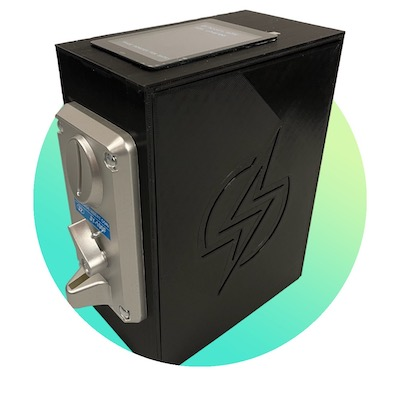
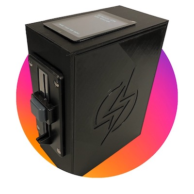

# bitcoin-lightning-atm

The purporse of this repo is to help you setup your own Bitcoin Lightning ATM.  Currently there are 3 different configurations as follows:

###Penny ATMs

###Multi Coin ATM

# License
The code distributed and the product itself is GPLv3.  The purpose of this is to protect the community and ensure that any innovations will remain public under the following license agreements: 

1. Anyone can copy, modify and distribute this software.
2. You have to include the license and copyright notice with each and every distribution.
3. You can use this software privately.
4. You can use this software for commercial purposes.
5. If you dare build your business solely from this code, you risk open-sourcing the whole code base.
6. If you modify it, you have to indicate changes made to the code.
7. Any modifications of this code base MUST be distributed with the same license, GPLv3.
8. This software is provided without warranty.
9. The software author or license can not be held liable for any damages inflicted by the software.

More information about this license can be found [here](http://choosealicense.com/licenses/gpl-3.0/).