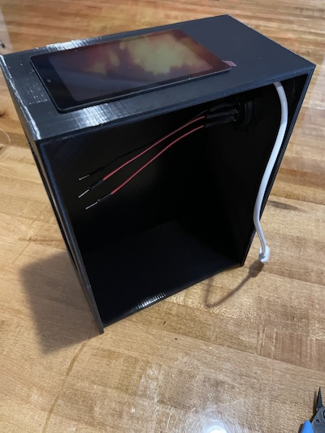
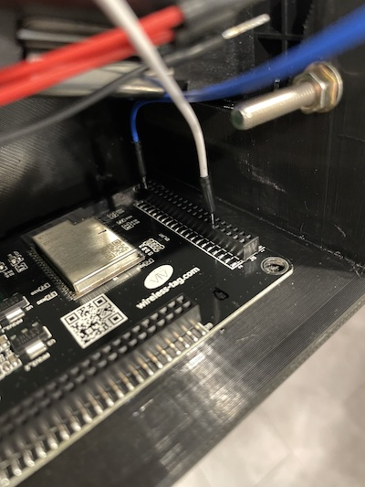

# Bitcoin Penny ATM (LED)

#### This ATM can be built for about `$150 USD` in materials

`Pros`: Professional/Modern looking, save more of your SATS from sale

`Cons`: Only accepts a single coin as input (penny)

## Video Walkthrough
[https://www.youtube.com/watch?v=A0-by4YgqxY](https://www.youtube.com/watch?v=A0-by4YgqxY)

## Required Parts:

- [Coin Acceptor](https://amzn.to/421g9J6)
- [ESP32 Micro Controller](https://amzn.to/40ixlse)
- [12V to 5V USB Adaptor](https://amzn.to/3L7NEUk)
- [12V Toggle Switch](https://amzn.to/3UNaFzg)
- [12V Battery Pack](https://amzn.to/3H1W39t)
- [Breadboard](https://amzn.to/40iYhb4)
- [10K Resister](https://amzn.to/40sGIFH)
- [Shrink Tubing](https://amzn.to/3ojl0H0)
- [Breadboard Jumper Wires](https://amzn.to/3GPbUIl)
- [AA Batteries x 8](https://amzn.to/41vrUqK)

## Recommended Tools

## Assembly Instructions

### Print the 3D parts
1. Print the [3D Box](../../3D/body.stl), then print the [Slotted Side Panel](../../3D/lid.stl).
   ####
   

### LNBits Wallet Setup
- Go to [LNBits](https://legend.lnbits.com/) and create a wallet (give it whatever name you wish). Once created, it will show a warning that the wallet is only secured by this URL.  Copy the URL.
- In the root of this project, go into the qrcodejs folder and open index.html.  Paste your wallet URL and it will generate a QR code for you to print.  I suggest taping this to the back of a post it note and putting it inside of your ATM for safekeeping. Deposit whatever you are comfortable with (I recommend 5,000 sats).
- `NOTE: This method of storing BTC is not secure and I only recommend putting 10,000 sats or less on this wallet just for demonstrating the functionality of the ATM to your friends/family on the go.  Keep your SATS safe at all times :)`
- Go to the extensions tab and add/enable "LNURLDevice", then click on it in the sidebar menu.
- Enter in the following information.  
- On this screen, make sure to copy the id and key - we will use these in our code in the next section. 

### Micro Controller Configuration
While that is printing, lets prepare the micro controller.
- Download the [Arduino IDE](https://www.arduino.cc/en/software)
- Once installed, connect the micro controller to your computer via USBC, and from the dropdown select "Select other board and port...", and select the "ESP32 Dev Module" and on the right select your USB port that it is connected to.
- Copy and paste the code from the arduino-code folder into the editor. Replace the "DEVICE_ID" with our id from the previous section, and "SECRET_CODE" with our key from the previous section.
- Click the upload button (the second button on the top left).  Once it uploads to the micro controller you should see the Bitcoin ATM screen.  It can safely be removed from the computer and is ready for the assembly into our box.

### Coin Acceptor Configuration
On the side of the coin acceptor there is a slot for a coin to be added.  Slide the sample coin out and insert a penny into the slot - make sure it is seated securely.

SW1 - N.O

SW2 - 50ms

SW3 - NOM

### Assembling the ATM
Now we get to put everything together and make this functional!

#### Assemble the LCD Screen
- Start by taking apart the LCD panel. There are tiny little tabs that lock into the metal plate so gently pry them until you can get the top and bottom separated.  
- Before assembling it into the ATM, ensure your printer made the LCD hole perfectly straight.  If necessary, shave the edges to be straight before inserting. Insert it through the top of the ATM at an angle.  Get the steel plate situated first, then place the top down on top of it.  
- Flip the ATM upside down and press so it makes a tight fit.  
- Plug the USBC cable into the micro controller, then gently lift the cable and press it down with some hot glue (do not get it on the board).  This will hold the LCD firmly in place so it never wants to come apart.  

#### Assemble the Toggle Switch
- On to the toggle switch! There are 3 pins on the toggle switch, the silver is the ground (black), and the two golds are power (red).  
- Solder a black wire onto the silver pin, and two red wires on the gold pins.  
- Slide shrink tubing onto the wires and shrink them with a lighter.  
- Smooth out the 3D hold with a utility knife and then slide the toggle switch into the device.  
- Place the nut through the wires and spin it onto the toggle switch.  I prefer the LED of the toggle switch to be facing downward, but it doesn't really matter for functionality.  

#### Assemble the Coin Acceptor
- Plug the coin acceptor wires into the back of the device (snip the gray wires), and place it through the front of the box.  Secure it loosely with the top two bolts.  
- Secure the device with the bottom two bolts and tighten when everything aligns squarely on the front of the device.  

#### Assembling the Breadboard
- Prepare the breadboard by peeling off the sticky backing.   
- Place the breadboard in the upper right of the box.  You will want to place it so that all of the holes are accessible   

#### Connecting the 12V to 5V Power Adapter
- Prepare the 12V step down adapter, and grab some super glue or hot glue.   
- Apply some glue to the back of the adapter.   
- Orientation is important!  Place the adapter just below the toggle switch nut with the red and black wires facing the outside opening of the box.  The USB wire should naturally want to wrap around the toggle wires.  Make sure not to block the panel slot when fixing this to the box.   
- Wrap the excess USB wire around the toggle nut wires (2x) and then glue it to the top of the adapter box.  This holds everything nice and secure for us and still makes it accessible.   
- You can now plug in the white USB cable to the 12V adapter.

#### Wiring the device
- The wiring it fairly straightforward, just make sure to save the red wire coming from the center pin of the toggle switch, as that will go directly to our battery bank.  Here is a couple images showcasing the wiring diagram.      
- Connect the white and blue wires to the micro controller.  The ATM is upside down in this picture - the white wire goes 6 holes in, and the blue wire is the last hole.   .
- When you are all finished wiring, it should look like this!   

#### Connecting it to power
- Prepare the battery bank. Place shrink tubing over the red and black wires and then solder the red wire to the wire coming from the center toggle switch wire.  Connect a black wire to the breadboard and solder that to the battery bank black wire.   
- Using a lighter, shrink the shrink tubing.   
- Place a 3M strip to the side of the battery bank and press it against the front so we have plenty of room for our coins to drop into the ATM. 

#### Slide the Panel on @TODO
- Time to close this thing up and power it on!   
- Here is our finished product.  Power it on and enjoy!    